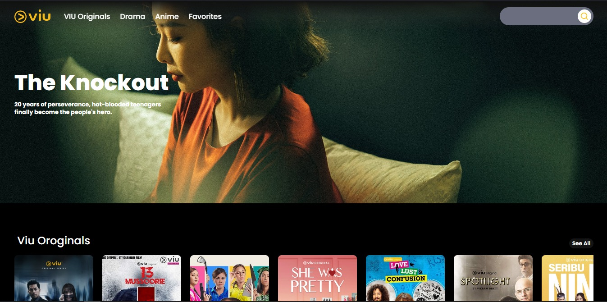
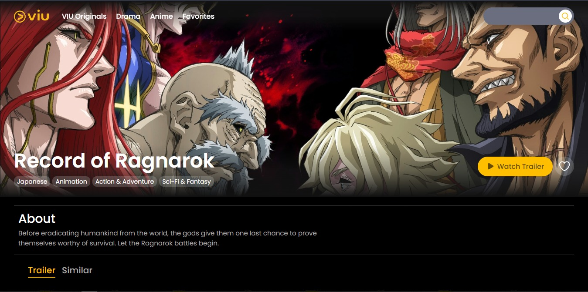

# Viu Clone

This is the result of my journey of learning ReactJS, make a clone of [Viu](https://viu.com/). These are my tools to build this app:

1. [React](https://reactjs.org/) with [Vite](https://vitejs.dev/) (Javascript library and build tool)
2. [Zustand](https://github.com/pmndrs/zustand) (state manager)
3. [TMDB](https://www.themoviedb.org/) (movie API)

This app is deployed on [Netlify](https://www.netlify.com/). You can visit it [here](https://viu-clone.netlify.app/)

## Screenshots

